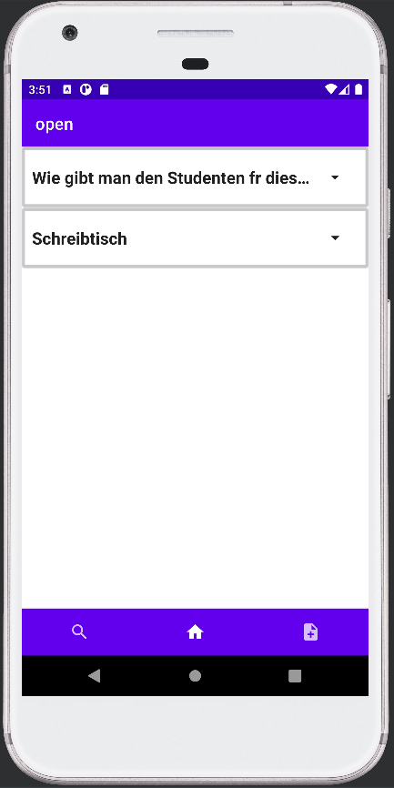
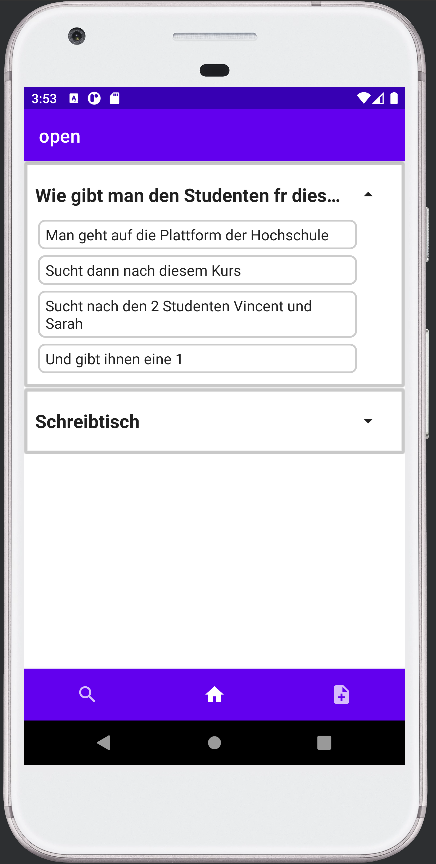
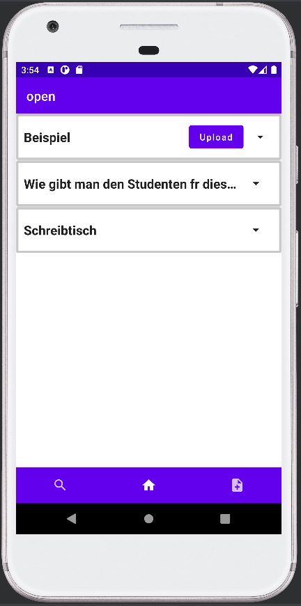
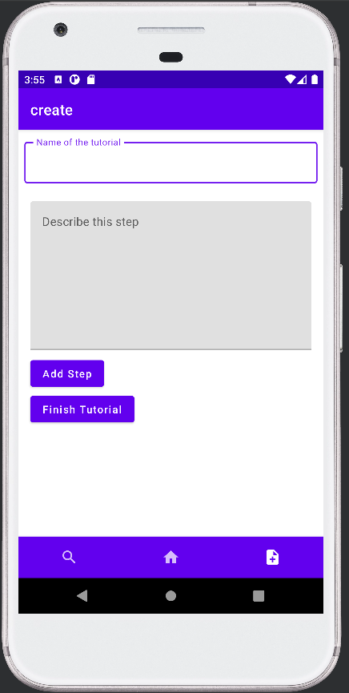
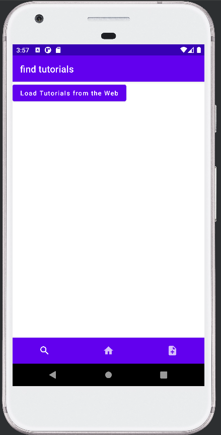

# Futorial
Herzlich willkommen zu unserer Abgabe!
Futorial ist eine App zum Erstellen, Speichern und Teilen von Tutorials aller Art!

## Tutorial für Futorial

Futorial hat 3 Screens:

### Start Screen

Der Startscreen gibt eine Übersicht über alle lokal vorhandenen Tutorials.

Wenn man auf ein Tutorial klickt öffnet es sich und zeigt die einzelnen Schritte an welche man befolgen muss.

Wenn ein Tutorial noch nicht hochgeladen wurde erscheint ein Button, der genau das macht.

### Create Screen

Um ein neues Tutorial zu erstellen muss man auf die Create seite gehen. Dort ist bereits ein Formular geöffnet, bei dem man den Namen seines Tutorials sowie die einzelnen Schritte angeben kann. 
Wenn das Tutorial fertig ist muss man nur auf "Finish Tutorial" drücken, und schon wird das Tutorial lokal gespeichert. 

### Search Screen

Wenn man nach Tutorials suchen möchte muss man einfach auf den Knopf "Load Tutorials from the Web" drücken, woraufhin alle online vorhandenen Tutorials geladen werden

## WebServer

Die Kommunikation zur MongoDB läuft über einen eigens dafür geschriebenen WebServer der [hier](https://github.com/VinuelMancent/appDevService "AppService") einzusehen ist. Der Branch, von dem deployed wurde, heißt golang2 (es gab ein paar Probleme mit dem Deployen von einem in C# geschriebenen Server bei heroku, daher musste ein bisschen experimentiert werden)

## Known Bugs

* Beim Hoch- und Runterladen von Tutorials gehen u.A. Umlaute und 'ß' verloren
* Zulange Titel werden beim Anzeigescreen abgeschnitten
* Der Download-Button bleibt selbst nach dem erfolgreichen Download clickable, es muss erst der Screen gewechselt werden
* Beim Erstellen einer App bleibt der Titel auch nach dem absenden sichtbar, es muss erst der Screen gewechselt werden
